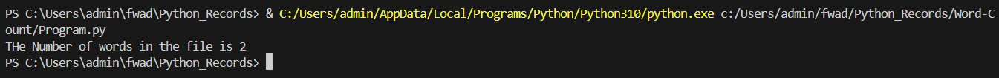

# Word-Count
## AIM:
To write a python program for getting the word count from a text.
## EQUIPEMENT'S REQUIRED: 
PC
Anaconda - Python 3.7
## ALGORITHM: 
### Step 1:
Import numpy as np.
### Step 2: 
 Enter the input values.
### Step 3: 
Write python program for getting the word count from the contents of a file using command line arguments.
### Step 4:  
Run the program.
### Step 5: 
Input the values.
### Step 6: 
End the program.

## PROGRAM:
```python
num = 0
with open("Word-Count/Text.txt","r") as f:
    for i in f:
        w = i.split()
        num += len(w)
print("THe Number of words in the file is",num)
```
### OUTPUT:


## RESULT:
Thus the program is written to find the word count from a text.
